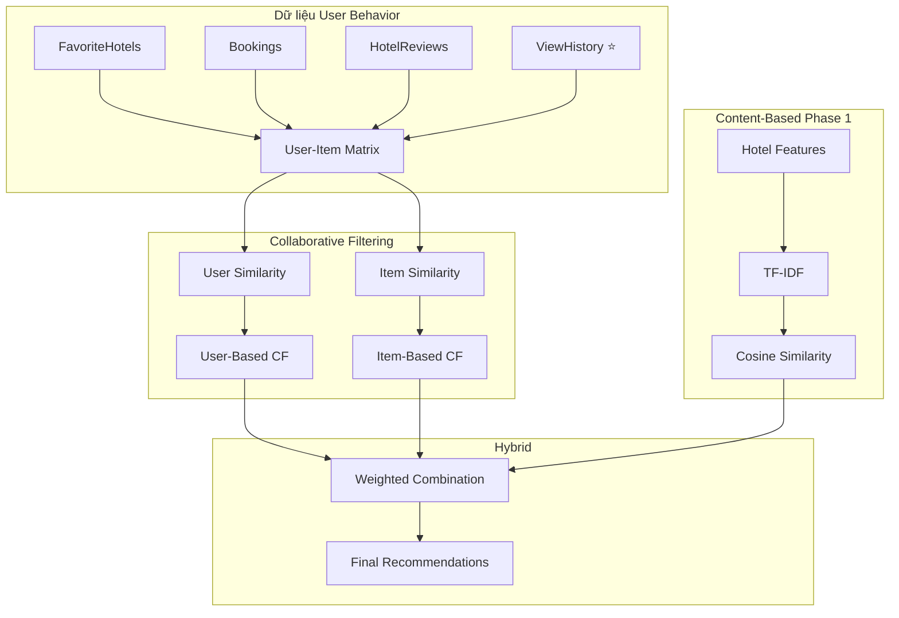

# Phase 2: Hybrid Recommendation System

Triển khai hệ thống gợi ý kết hợp (Hybrid) bằng cách thêm **Collaborative Filtering** và tích hợp với **Content-Based** đã có trong Phase 1.

## Tổng quan kiến trúc



## Rating Weight từ User Behavior

| Data Source | Base Score | Condition Bonus | Max Score |
|-------------|------------|-----------------|-----------|
| `ViewHistory` | 2.0 | +0.5 nếu `viewDuration > 60s`, +0.5 nếu `viewDuration > 180s`, +1.0 nếu `clickedBooking`, +1.0 nếu `clickedFavorite` | 5.0 |
| `FavoriteHotels` | 4.0 | - | 4.0 |
| `Bookings` (hotel) | 5.0 | - | 5.0 |
| `HotelReviews` | `average_rating` | - | 5.0 |

> [!NOTE]
> Cold-start handling **không cần thiết** - Java đã xử lý hiển thị mặc định.

## Proposed Changes

### Module Collaborative Filtering

#### [NEW] [collaborative.py](file:///d:/Source%20Travell/recommend/recommender/collaborative.py)

Tạo module mới cho Collaborative Filtering với các thành phần:

1. **Xây dựng User-Item Rating Matrix:**
   - `ViewHistory`: base 2.0 + bonus (duration/viewedRooms/clickedFavorite)
   - `FavoriteHotels`: rating = 4.0 (implicit positive)
   - `Bookings` (hotel): rating = 5.0 (strong intent)
   - `HotelReviews`: sử dụng `average_rating` thực tế

2. **User-Based Collaborative Filtering:**
   - Tính User Similarity bằng Cosine Similarity
   - Gợi ý hotels mà users tương tự đã thích

3. **Item-Based Collaborative Filtering:**
   - Tính Hotel Similarity dựa trên ratings của users
   - Gợi ý hotels tương tự dựa trên interaction patterns

---

### Module Hybrid

#### [NEW] [hybrid.py](file:///d:/Source%20Travell/recommend/recommender/hybrid.py)

Tạo module kết hợp:

**Weighted Hybrid:**
```python
# Công thức kết hợp
hybrid_score = (α × content_score) + (β × collab_score)

# Mặc định α = 0.5, β = 0.5
```

---

### Cập nhật Views

#### [MODIFY] [views.py](file:///d:/Source%20Travell/recommend/recommender/views.py)

Thêm 2 API endpoints mới:

1. **`get_user_recommendations(user_id)`**
   - Gợi ý hotels cá nhân hóa cho user cụ thể
   - Sử dụng Collaborative Filtering làm chính

2. **`get_hybrid_recommendations(hotel_id, user_id=None)`**
   - Kết hợp Content-Based và Collaborative
   - Nếu không có user_id: fallback về Content-Based thuần

---

### Cập nhật URLs

#### [MODIFY] [urls.py](file:///d:/Source%20Travell/recommend/recommender/urls.py)

Thêm routes mới:

```python
# Phase 2: Hybrid Recommendations
path('recommend/user/<int:user_id>/', views.get_user_recommendations),
path('recommend/hybrid/<int:hotel_id>/', views.get_hybrid_recommendations),
```

---

## Verification Plan

### Test với Django Shell

```bash
cd d:\Source Travell\recommend
python manage.py shell
```

```python
# Test Collaborative Filtering module
from recommender.collaborative import train_collaborative_model, get_cf_recommendations

# Train model
train_collaborative_model()

# Test với user có history
recommendations = get_cf_recommendations(user_id=1, limit=5)
print(recommendations)
```

### Test API Endpoints

```bash
# Test user recommendations
curl http://localhost:8000/api/recommend/user/1/

# Test hybrid recommendations
curl http://localhost:8000/api/recommend/hybrid/1/?user_id=1
curl http://localhost:8000/api/recommend/hybrid/1/

# So sánh với Content-Based thuần (Phase 1)
curl http://localhost:8000/api/recommend/1/
```

### Manual Testing Checklist

1. **Cold-start user:** Tạo user mới (không có favorites/bookings/reviews), kiểm tra fallback về Content-Based
2. **Active user:** Dùng user có đủ data, kiểm tra recommendations có liên quan đến behavior
3. **Retrain:** Gọi `/api/model/retrain/` và verify cả 2 models được update
